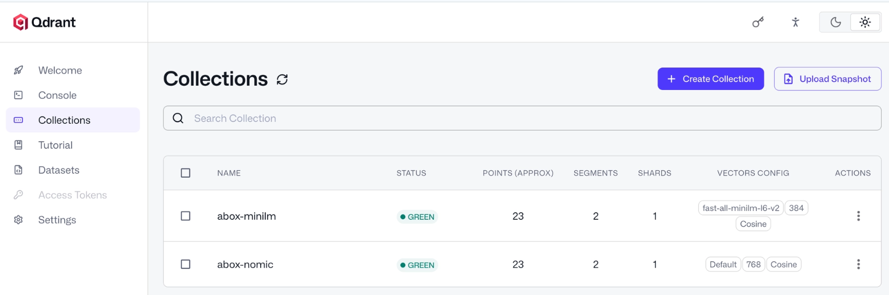

# ADR-004: Agentic Retrieval: custom qdrant-mcp (nomic) vs official mcp-server-qdrant (MiniLM)

- **Status:** Proposed
- **Date:** 2026-10-06
- **Course:** fwdays — Harness Engineering, Lab 4
- **Repo:** [sunrooff/harness-abox](https://github.com/sunrooff/harness-abox) (fork of [den-vasyliev/abox](https://github.com/den-vasyliev/abox))
- **Branch:** [`feat/llmd-embeddings`](https://github.com/sunrooff/harness-abox/tree/feat/llmd-embeddings), run in GitHub Codespaces

## Task

Compare retrieval quality of `retrieval-agent` with 2 different MCP servers for Qdrant (vector database).

| | Custom (nomic) | Official (MiniLM) |
|---|---|---|
| MCP server | `qdrant-mcp` | `mcp-server-qdrant` (deployed as `qdrant-mcp-official`) |
| Embeddings | `llama.cpp`, separate shared service | `fastembed` (in-process ONNX embeddings) inside MCP pod |
| Model | `nomic-embed-text-v1.5` | `all-MiniLM-L6-v2` |
| Dimensions | 768 | 384 |
| Search output | hits with scores | hits without scores |
| Memory limit | 256Mi + llama.cpp 1Gi (shared) | 2Gi (OOMKilled at 256Mi) |

## Workflow

1. Flux is paused during lab (so it does not revert changes for `retrieval-agent`)
2. Saved OpenAI API key to `default-model-config` via kagent UI
   - point model at it and restart agents:
      ```bash
      kubectl -n kagent patch modelconfig default-model-config --type=merge -p '{"spec":{"apiKeySecret":"default-model-config"}}'
      kubectl -n kagent rollout restart deploy/k8s-agent deploy/retrieval-agent
      ```
3. Added a separate manifest for the official `mcp-server-qdrant` (search limit 5, same as custom): [manifests/qdrant-mcp-official.yaml](manifests/qdrant-mcp-official.yaml)
4. Within `retrieval-agent`:
   - switched tools to the relevant for official server (`k8s-agent` unchanged, neo4j removed);
   - adjust system prompt for new tools: [prompts/retrieval-agent.official.md](prompts/retrieval-agent.official.md)
   - switch between modes with `kubectl apply`: [official](manifests/retrieval-agent.official.yaml) / [custom](manifests/retrieval-agent.custom.yaml)
5. Ingested same 23 objects (kagent CRs + HelmReleases) through the agent into **2 collections**, one per MCP server.
   
6. Asked 10 fixed questions — [eval/golden-set.md](eval/golden-set.md) — with [eval/run_eval.py](eval/run_eval.py):
   - **raw** — straight to the search tool (no LLM)
   - **agent** — to `retrieval-agent`, new session each
7. Added 3rd run: "**custom-tuned (nomic)**":
   - edited prompt of custom `qdrant-mcp` (nomic): "search vectors first, then the graph"
   - [manifests/retrieval-agent.custom-tuned.yaml](manifests/retrieval-agent.custom-tuned.yaml)


### Ingest

Same messages in both modes, one **New Chat** per message, ~1 minute apart:

1. `Ingest these objects: all kagent.dev Agent objects in namespace kagent. List them first. Then work strictly one object at a time: fetch it by name, store it, and only then move to the next. Never call tools in parallel.`
2. Same, for `all kagent.dev ModelConfig, MCPServer and RemoteMCPServer objects in namespace kagent`.
3. Same, for `all HelmRelease objects in every namespace`.

**Why 3 messages?**
- one message for everything has failed
- parallel `qdrant-store` calls raced to create the collection (`409`),
- and parallel fetches through `k8s-agent` hit the OpenAI limit (`429`, 200k tokens/min).
- In the custom run the agent asked a clarifying question on message 3 and skipped one HelmRelease; a 4th message added it.

| Mode | Collection | Dim | Points |
|---|---|---|---|
| official (MiniLM) | `abox-minilm` | 384 | 23 |
| custom (nomic) | `abox-nomic` | 768 | 23 |

Both hold the same objects: 7 Agent, 1 ModelConfig, 3 MCPServer, 2 RemoteMCPServer, 10 HelmRelease.
Stored texts: [eval/corpus-minilm.json](eval/corpus-minilm.json), [eval/corpus-nomic.json](eval/corpus-nomic.json).


## Results

| | official (MiniLM) | custom (nomic) | custom-tuned (nomic) |
|---|---|---|---|
| **Quality** | | | |
| raw: right object 1st (Q1–Q9) | **8/9** | 7/9 | 7/9 |
| agent score (Q1–Q10) | 8.5 | 6 | **9** |
| agent used vector search | 8/10 | 2/10 | 9/10 |
| **Cost** | | | |
| tool calls per question | **0.9** | 2.7 | 1.1 |
| median latency | 2.7 s | 3.5 s | **2.4 s** |
| memory limit | 2Gi per MCP pod | 256Mi MCP + 1Gi llama.cpp (shared) | 256Mi MCP + 1Gi llama.cpp (shared) |
| model load | every MCP session; 12 s cold, ~3 s warm | once, when llama.cpp starts | once, when llama.cpp starts |

Per question: [eval/results.md](eval/results.md). Tool calls are observed calls, not LLM requests; LLM requests, tokens and money were not measured (Phoenix was down). Memory rows are configured limits, not measured usage.

## Findings

| Area | Finding | Evidence | Action |
|---|---|---|---|
| Quality | Embedding models are close | raw search differs in one question (Q6) | — |
| Quality | Tool routing decides the agent score | custom prompt sends the agent to the graph first; bad Cypher missed Q1, Q4, Q9; one rule changed → 6 → 9 | put "vector_find first" into the prompt |
| Quality | Skipping the search still fails | Q6 failed in every run: answered without a tool call | add a check that rejects answers without a tool call |
| Cost | Official is heavier to run | model reload per MCP session (12 s cold), 2Gi per pod, `409` race on first write | use it only where no embeddings service exists |
| Cost | The routing rule cuts tool calls | 2.7 → 1.1 tool calls per question (official: 0.9) | — |
| Risk | Secrets leak through ingest | official mode stored the neo4j password in the vector store (redacted in the export) | tell ingest prompts to drop secrets |

## Limitations

- One run per setup, 10 questions, small corpus: one answer = 10 %, so 9 vs 8.5 is not a stable difference.
- Prompts, toolsets and stored texts differ between modes, so this does not isolate embedding quality; the raw row is the closest to it.
- No relationship questions were asked, so "vector_find first" is untested on questions the graph should answer.

## Decision

Keep custom **nomic** (via llama.cpp) and change the prompt rule to **"vector_find first, the graph for relationships"**.
- Quality is the same: 9 vs 8.5 is too small a gap to call either model better
- Custom (nomic) is lighter by design: the model loads once and is shared (actual usage and cost not measured)
- The prompt rule gave the biggest gain (+3 answers) at no cost