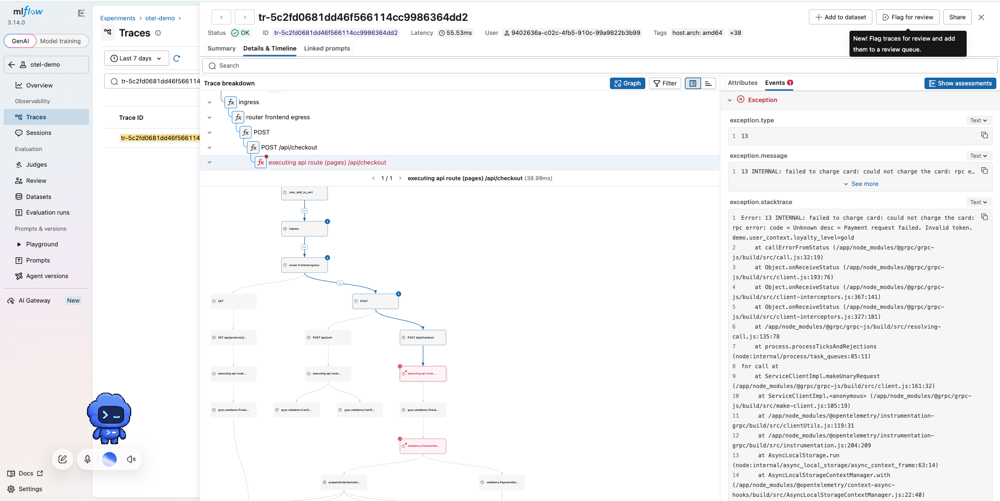

# ADR-006: OpenTelemetry Demo — observability walkthrough

- **Status:** Proposed
- **Date:** 2026-10-07
- **Course:** fwdays — Harness Engineering, Lab 6
- **Repo:** [sunrooff/harness-abox](https://github.com/sunrooff/harness-abox) (fork of [den-vasyliev/abox](https://github.com/den-vasyliev/abox))
- **Branch:** [`feat/otel-demo`](https://github.com/sunrooff/harness-abox/tree/feat/otel-demo), run in GitHub Codespaces

> **Result:** one trace explains a failed order from start to end. But MLflow marked all 9 failed orders as OK or
> In progress, so its trace list alone hides failures.

## Task

1. Deploy abox from the otel branch and study the [OTel Demo architecture](https://opentelemetry.io/docs/demo/architecture/).
2. Try the demo shop and note o11y questions and observations.
3. *(Optional)* Add our agents / kagent to the o11y system.

## Workflow

1. Install got stuck on ngrok-operator (it needs a credentials Secret), so everything else waited for it.
   - ngrok dependency was removed dure to no need within Lab 6:
      ```bash
      kubectl -n flux-system annotate resourceset releases fluxcd.controlplane.io/reconcile=disabled
      kubectl -n flux-system patch kustomization releases --type=merge -p '{"spec":{"dependsOn":[]}}'
      ```
   - not needed as well by now: triage (private registry), xray-memory, agentgateway-llm (needs a Gemini key)
2. Opened Astronomy Shop + feature flags page
3. Traces go only to MLflow (Jaeger, Prometheus, Grafana and OpenSearch are off in this branch).
   - MLflow dropped every span: the collector sends to experiments `2` and `3`, a new MLflow has only `0`
   - created them through the MLflow API → traces arrived
4. Followed one successful order in MLflow — 9 services in 7 languages, over gRPC, HTTP and Kafka:
   ```
   frontend-proxy (Envoy)
     └─ checkout (Go) PlaceOrder
         ├─ cart (.NET) · product-catalog (Go) · currency (C++)
         ├─ shipping (Rust) → quote (PHP)
         ├─ payment (JavaScript) Charge
         ├─ email (Ruby)
         └─ orders publish → Kafka
   ```
5. Broke payments: flag `paymentFailure` = 50 %.
   - 9 of the 20 latest orders failed ([sample](evidence/payment-failure-sample.json))
   - the trace shows where (`Charge`), why (`Invalid token` + stack trace) and the flag check right before it
   - but MLflow showed **none** of them as Error: 8 *In progress*, 1 *OK*

      

## Findings

| Area | Finding | Evidence |
|---|---|---|
| Tracing | One trace shows a whole order across 9 services | step 5 |
| Tracing | The cause of a failure is visible without logs | exception, stacktrace, flagd spans in `Charge` |
| Tracing | Kafka consumers are not in the order trace | `orders publish` is there, `accounting` / `fraud-detection` spans are not |
| MLflow | MLflow hides failed orders | MLflow takes the trace status from the root span ([source](https://github.com/mlflow/mlflow/blob/v3.14.0/mlflow/store/tracking/sqlalchemy_store.py#L5453-L5470)): the load generator's root is *unset* → *OK*; no root → *In progress* |
| MLflow | Long streams sit next to normal requests | flagd `EventStream` traces of 600–746 s at the top of the list |
| Monitoring | No metrics or logs | can't answer "what % of payments fail now" without scripting the traces |
| Setup | A new cluster does not work out of the box | ngrok dependency, missing MLflow experiments |

## Questions

1. How to alert on a failing payment rate when only traces are collected?
2. Should the load generator mark a failed checkout as ERROR on its root span?
3. Should long-lived streams like flagd `EventStream` be traced at all?
4. Why are the Kafka consumers missing from the order trace?
5. What does a GenAI trace of the shop's own agent look like next to these? → lab 7

## Decision

For lab 7, compare three tools on the same traffic: keep MLflow, add Jaeger as the "standard otel" UI,
and send traces of the shop agent and `retrieval-agent` to all three.

**Limitations:** traces only (no metrics or logs backend); one failure scenario; one run.
