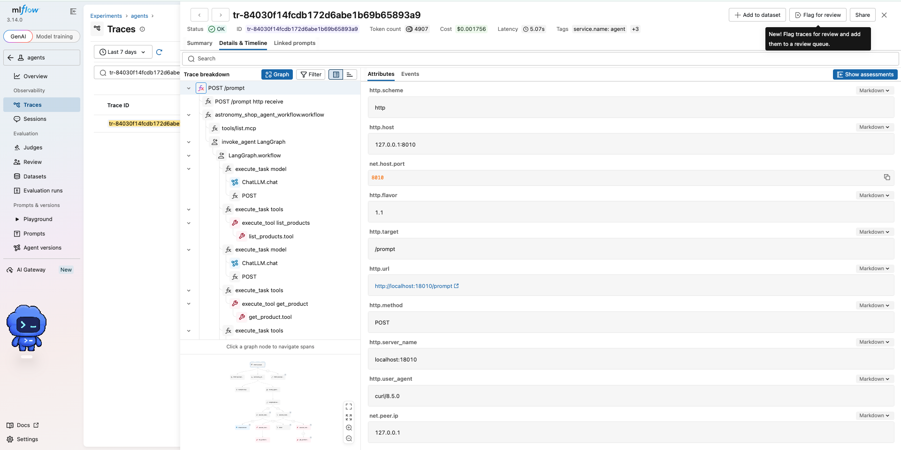

# ADR-007: GenAI observability — OTel (Jaeger) vs MLflow vs Phoenix

- **Status:** Proposed
- **Date:** 2026-10-07
- **Course:** fwdays — Harness Engineering, Lab 7
- **Repo:** [sunrooff/harness-abox](https://github.com/sunrooff/harness-abox) (fork of [den-vasyliev/abox](https://github.com/den-vasyliev/abox))
- **Branch:** [`feat/otel-demo`](https://github.com/sunrooff/harness-abox/tree/feat/otel-demo)

> **Result:** all 3 tools received the same agent traces. MLflow covered all tested scenarios and was the only tool with a readable view of kagent prompts in that setup.

## Task

1. Get familiar with otel, mlflow and phoenix UI.
2. Get traces of the Astronomy Shop agent, retrieval agent or any kagent agent.
3. Compare plain otel vs mlflow vs phoenix from a GenAI point of view.

## Workflow

1. Used Lab 6 cluster and paused Flux, so it does not undo our changes.
2. Added one `collector` that sends the same traces to all three tools:
   ```
   kagent agents (k8s-agent, retrieval-agent) ─┐
                                                ├─► collector ─┬─► Jaeger  (we added it; it is off in this branch)
   shop agent (agent + chatbot + mcp)          ─┘              ├─► MLflow  (experiment "agents")
                                                               └─► Phoenix (project "default")
   ```
   - [manifests/collector.yaml](manifests/collector.yaml), [manifests/jaeger.yaml](manifests/jaeger.yaml)
   - Phoenix needs a key to accept traces → created a system API key for the collector
   - MLflow experiment id (`4`) is set in the collector; it will be different in a new cluster
   - order: namespace `lab7` → Secret `phoenix-api-key` (system key from Phoenix) → MLflow experiment
     (`POST /api/2.0/mlflow/experiments/create`, note the id) → jaeger + collector → patches below
3. Turned on tracing in kagent: [manifests/kagent-tracing-values.patch.json](manifests/kagent-tracing-values.patch.json)
   - side effect: chart replaced my OpenAI key Secret with a placeholder → copied the key back by hand
4. Connected shop agent to OpenAI `gpt-4.1-mini`, turned on its MCP tools and turned off VCR
   (by default the demo replays recorded LLM answers instead of calling a real LLM):
   [manifests/shop-agent-values.patch.json](manifests/shop-agent-values.patch.json)
5. Sent traffic with [traffic.sh](traffic.sh) (kagent part again: [traffic-kagent.sh](traffic-kagent.sh)):
   - shop agent: 5 questions
   - k8s-agent: a 2-message chat + 1 question
   - retrieval-agent: indexing (it calls k8s-agent) + 3 questions, one answered wrong

## Results

Main trace: shop agent, *"Compare the two most expensive telescopes"* — 26 spans, 3 LLM calls, 3 tool calls,
4907 tokens: [tokens per LLM call](evidence/reference-trace-tokens.json).

✅ checked and works · ❌ not found


| | Jaeger | MLflow | Phoenix |
|---|---|---|---|
| Spans received ([4 test traces](evidence/scenario-traces.json)) | ✅ all | ✅ all | ✅ all |
| Where time goes | ✅ [timeline](screenshots/jaeger-trace.png) | ✅ [timeline](screenshots/mlflow-timeline.png) | ✅ bars in the tree |
| Shop agent chat (prompt, tools, answer) | ✅ [per LLM call](screenshots/jaeger-genai-span.png) | ✅ [Chat tab](screenshots/mlflow-chat.png) | ✅ [full input](screenshots/phoenix-llm-span.png) + Playground |
| kagent agent prompt | raw attribute only | ✅ [Inputs / Outputs](screenshots/mlflow-kagent-llm.png) | [raw attribute](screenshots/phoenix-agent-to-agent.png); Input section not opened |
| Tokens and cost per trace | ❌ per call only | ✅ [in the header](screenshots/mlflow-trace.png): tokens + estimated cost | [per call](screenshots/phoenix-trace.png); cost rounded |
| Chat sessions | ❌ | ✅ [sessions view](screenshots/mlflow-sessions.png), feedback buttons | ✅ [with tokens](screenshots/phoenix-sessions.png) |
| Agent calls agent | ✅ [one tree](screenshots/jaeger-agent-to-agent.png) | ✅ [one tree](screenshots/mlflow-agent-to-agent.png) | ✅ [one tree](screenshots/phoenix-agent-to-agent.png) |
| Find why an answer is wrong | ✅ (attributes) | ✅ [tool input/output](screenshots/mlflow-wrong-answer.png) | ✅ [tool span](screenshots/phoenix-wrong-answer.png) |
| Failed run marked as error | ✅ [error count](screenshots/jaeger-search-prompt.png) | ✅ | ✅ |
| Evals / feedback | ❌ | not run (Judges, Review, feedback in the menu) | not run (Evaluators, Annotations, Playground in the menu) |
| Memory limit | 512Mi | 2Gi (crashed with 1Gi before) | server + Postgres |




## Findings

| Area | Finding | Evidence |
|---|---|---|
| Tracing | Trace context passes between agents | one trace of 146 spans holds both retrieval-agent and k8s-agent |
| Tracing | What you see depends on how the agent is instrumented | shop agent sends its chat in standard `gen_ai.*` fields → all tools show it; kagent sends its prompt in its own field → MLflow shows it as inputs / outputs, Jaeger and Phoenix as a raw attribute |
| Debugging | A wrong answer can be explained from the trace | the graph query returned `[]`; neo4j had 7 Agent nodes and 0 relations, but the agent answered "none" instead of "no data"; the trace status stays OK — wrong answers need evals, not error tracking |
| Cost | Token totals match across tools | for the 2 checked traces, totals equal the sum of unique LLM spans: 4907 ([3 calls](evidence/reference-trace-tokens.json)) and 681 120 ([51 calls](evidence/ingest-trace-tokens.json)) |
| Cost | Agent indexing is expensive | one indexing run: 681 120 tokens, ~$0.30 by MLflow's estimate (not a bill) |
| Usability | Lists are full of 1-span HTTP traces | we had to filter to find agent traces in every tool ([Jaeger](screenshots/jaeger-search-all.png), [MLflow](screenshots/mlflow-traces-list.png)) |

## Decision

| Tool | Role | Why | Watch out |
|---|---|---|---|
| **MLflow** | ✅ main GenAI tool | covered all tested scenarios; the only one with a readable view of kagent prompts; tokens and estimated cost per trace and per call; sessions with feedback buttons | needs its own memory (2Gi limit, usage not measured) and storage |
| **Jaeger** | ✅ keep for timing | clear timeline; traces across services and agents | keeps traces in memory, loses them on restart |
| **Phoenix** | option | full LLM input and a Playground to replay prompts (seen, not tried) | needs auth and an API key; kagent prompts seen only as a raw attribute |

Agents send traces to one OTel collector, and it forwards them to MLflow and Jaeger (as in this lab:
[collector.yaml](manifests/collector.yaml)). To add or drop a tool, change only the collector.

**Limitations:** one environment and one session, no repeated benchmark; three agents in two frameworks;
`gpt-4.1-mini` only; evals not tried. Error status was checked on one failed run only. Screenshots in [screenshots/](screenshots/), numbers in [evidence/](evidence/).
